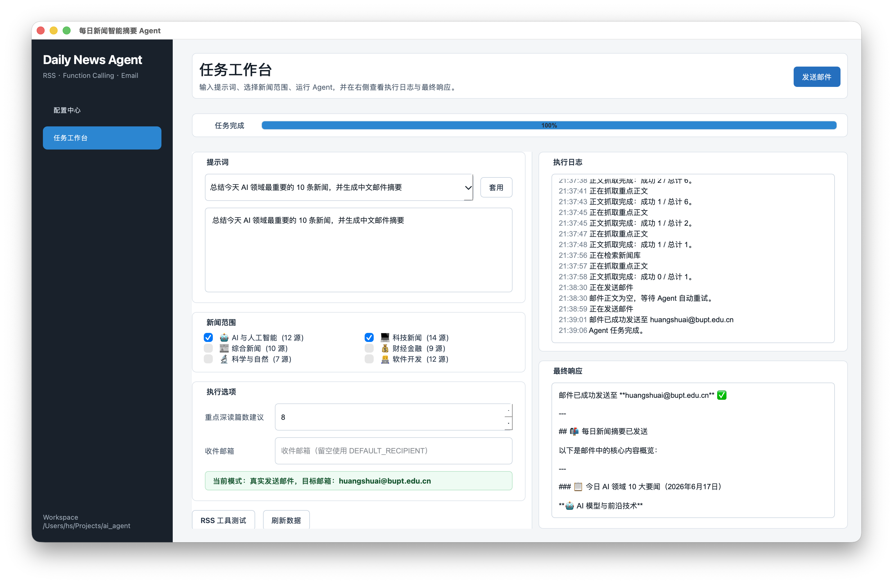
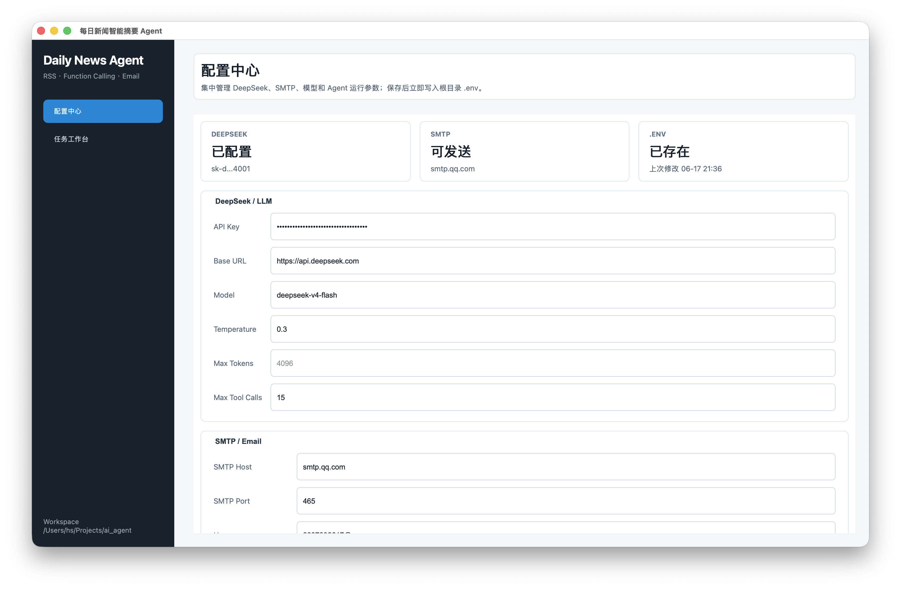
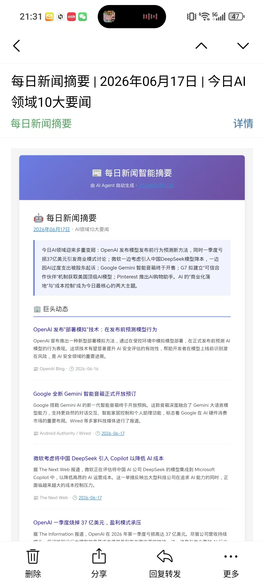
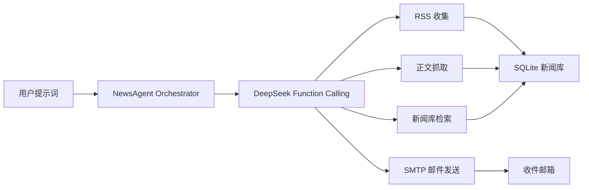
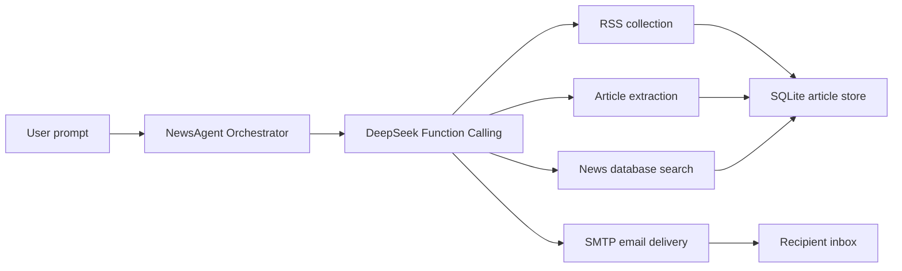

# Daily News Agent

<p align="center">
  <a href="#中文">中文</a> · <a href="#english">English</a>
</p>

<p align="center">
  <strong>A desktop AI news agent that collects RSS articles, reasons with function calling, and sends polished email briefings.</strong>
</p>

<p align="center">
  
</p>

---

## 中文

Daily News Agent 是一个面向日常新闻摘要场景的 Bring Your Own Agent 项目。它通过 DeepSeek Function Calling 调用本地工具，从多分类 RSS 源收集新闻、抓取重点正文、检索本地新闻库，并最终生成中文 HTML 邮件摘要发送到指定邮箱。

新版项目包含 PyQt6 图形化界面：可以在配置中心维护 `.env`，也可以在任务工作台输入提示词、选择新闻范围、查看进度和简化日志，然后直接发送邮件。

### 界面预览

| 任务工作台 | 配置中心 |
|---|---|
|  |  |

<p align="center">
  
</p>

### 主要功能

- PyQt6 桌面端工作台：默认启动图形界面，支持配置管理、任务运行、进度条、执行日志和最终响应。
- `.env` 可视化配置：集中维护 DeepSeek、SMTP、模型参数、Agent 工具调用上限和默认收件人。
- RSS 新闻聚合：覆盖 AI、科技、综合、财经、科学、软件开发等分类。
- Function Calling Agent：由 LLM 决定何时调用 RSS、正文抓取、新闻搜索和邮件发送工具。
- 重点正文抓取：对候选新闻进行网页正文提取，减少只依赖 RSS 摘要造成的信息不足。
- 本地新闻库：SQLite 持久化文章，支持去重、缓存、检索和统计。
- 真实邮件投递：通过 SMTP 发送 HTML 邮件，支持默认收件人、发件人头部规范化和移动端邮件样式整理。
- 简化运行日志：GUI 中只展示关键进度，避免长参数和完整 HTML 占满日志栏。

### 快速开始

```bash
git clone https://github.com/hsqwq/daily-news-agent.git
cd daily-news-agent

python3 -m venv .venv
source .venv/bin/activate

pip install -r requirements.txt
cp .env.example .env
```

编辑 `.env`，至少填入 DeepSeek API Key、SMTP 发信配置和默认收件人：

```bash
DEEPSEEK_API_KEY=sk-your-deepseek-api-key
DEEPSEEK_BASE_URL=https://api.deepseek.com
DEEPSEEK_MODEL=deepseek-chat

SMTP_HOST=smtp.qq.com
SMTP_PORT=465
SMTP_USERNAME=your-email@qq.com
SMTP_PASSWORD=your-smtp-authorization-code
SMTP_FROM_NAME=每日新闻摘要
SMTP_FROM_EMAIL=your-email@qq.com

DEFAULT_RECIPIENT=your-email@qq.com
```

启动图形界面：

```bash
python main.py
```

### 运行方式

```bash
# 默认：启动 PyQt6 图形化界面
python main.py

# 显式启动图形化界面
python main.py --gui

# 终端交互模式
python main.py --cli

# 单次任务，使用 DEFAULT_RECIPIENT 发送邮件
python main.py --prompt "总结今天 AI 领域最重要的 10 条新闻，并生成中文邮件摘要"

# 单次任务，覆盖收件邮箱
python main.py --prompt "总结今日财经要闻" --email me@example.com
```

> 当前版本以真实邮件投递为主。运行前请确认 SMTP 授权码、发件邮箱和默认收件人配置正确。

### 配置项

| 变量 | 说明 |
|---|---|
| `DEEPSEEK_API_KEY` | DeepSeek API Key |
| `DEEPSEEK_BASE_URL` | DeepSeek API 地址，默认 `https://api.deepseek.com` |
| `DEEPSEEK_MODEL` | 使用的模型名称 |
| `LLM_TEMPERATURE` | LLM 采样温度 |
| `LLM_MAX_TOKENS` | 单次响应最大 token 数 |
| `MAX_TOOL_CALLS` | Agent 最大工具调用轮数 |
| `SMTP_HOST` | SMTP 服务器地址 |
| `SMTP_PORT` | SMTP SSL 端口，常见值为 `465` |
| `SMTP_USERNAME` | SMTP 登录邮箱 |
| `SMTP_PASSWORD` | SMTP 授权码或应用专用密码 |
| `SMTP_FROM_NAME` | 邮件发件人显示名 |
| `SMTP_FROM_EMAIL` | 发件邮箱；QQ 邮箱通常需要与 `SMTP_USERNAME` 一致 |
| `DEFAULT_RECIPIENT` | 默认收件邮箱 |

### Agent 工具

| 工具 | 作用 |
|---|---|
| `fetch_rss_feeds` | 按分类或指定源批量收集 RSS 新闻 |
| `fetch_article_content` | 抓取网页正文并截断到可控长度 |
| `search_news` | 在本地新闻库中按关键词、分类和语言检索 |
| `send_email` | 生成并发送 HTML 邮件摘要 |

### 工作流



### 项目结构

```text
daily-news-agent/
├── agent/                  # Agent 编排、系统提示词和数据模型
├── config/                 # RSS 源与全局配置
├── tools/                  # RSS、正文抓取、搜索、邮件工具
├── utils/                  # SQLite 与文本处理工具
├── assets/readme/          # README 配图
├── data/                   # 运行时数据，默认不提交
├── gui.py                  # PyQt6 桌面界面
├── main.py                 # 程序入口
├── requirements.txt
└── .env.example
```

### 课程实验对应

| 要求 | 项目实现 |
|---|---|
| Bring Your Own Agent | 自建新闻摘要 Agent，支持工具调用与真实任务闭环 |
| 多工具/Skills | RSS 获取、正文抓取、新闻检索、邮件发送 |
| 上下文集成 | DeepSeek Function Calling 与本地 SQLite 新闻库 |
| 可运行产品形态 | PyQt6 桌面 GUI、CLI、单次命令运行 |
| 真实任务验证 | 可从 RSS 收集新闻并发送移动端可读的 HTML 邮件 |

---

## English

Daily News Agent is a Bring Your Own Agent project for daily news briefings. It uses DeepSeek Function Calling to operate local tools, collect RSS articles, fetch full article content, search the local news database, and send a polished Chinese HTML briefing by email.

The current version includes a PyQt6 desktop interface. You can manage `.env` settings in the configuration center, then use the task workbench to enter a prompt, select news categories, monitor progress, read concise logs, and send the final email.

### Screenshots

| Task Workbench | Configuration Center |
|---|---|
|  |  |

<p align="center">
  
</p>

### Features

- PyQt6 desktop workbench with configuration management, task execution, progress bar, concise logs, and final response output.
- Visual `.env` editor for DeepSeek, SMTP, model parameters, Agent limits, and default recipient.
- RSS aggregation across AI, technology, general news, finance, science, and software development categories.
- Function-calling Agent that decides when to call RSS, article extraction, search, and email tools.
- Full article extraction for important items, reducing dependence on short RSS snippets.
- SQLite-backed local article store with deduplication, caching, search, and statistics.
- Real SMTP email delivery with default recipient support, RFC-compatible sender headers, and mobile-friendly HTML cleanup.
- Compact GUI logs that show operational milestones instead of long tool arguments or raw HTML.

### Quick Start

```bash
git clone https://github.com/hsqwq/daily-news-agent.git
cd daily-news-agent

python3 -m venv .venv
source .venv/bin/activate

pip install -r requirements.txt
cp .env.example .env
```

Edit `.env` and provide at least your DeepSeek API key, SMTP credentials, and default recipient:

```bash
DEEPSEEK_API_KEY=sk-your-deepseek-api-key
DEEPSEEK_BASE_URL=https://api.deepseek.com
DEEPSEEK_MODEL=deepseek-chat

SMTP_HOST=smtp.qq.com
SMTP_PORT=465
SMTP_USERNAME=your-email@qq.com
SMTP_PASSWORD=your-smtp-authorization-code
SMTP_FROM_NAME=每日新闻摘要
SMTP_FROM_EMAIL=your-email@qq.com

DEFAULT_RECIPIENT=your-email@qq.com
```

Launch the desktop app:

```bash
python main.py
```

### Usage

```bash
# Default: launch the PyQt6 desktop GUI
python main.py

# Explicitly launch the GUI
python main.py --gui

# Interactive terminal mode
python main.py --cli

# One-shot task, using DEFAULT_RECIPIENT
python main.py --prompt "Summarize today's 10 most important AI news items in Chinese and send an email briefing"

# One-shot task with recipient override
python main.py --prompt "Summarize today's finance news" --email me@example.com
```

> This version is designed for real email delivery. Before running a task, make sure your SMTP authorization code, sender address, and default recipient are configured correctly.

### Configuration

| Variable | Description |
|---|---|
| `DEEPSEEK_API_KEY` | DeepSeek API key |
| `DEEPSEEK_BASE_URL` | DeepSeek API endpoint, defaults to `https://api.deepseek.com` |
| `DEEPSEEK_MODEL` | Model name |
| `LLM_TEMPERATURE` | LLM sampling temperature |
| `LLM_MAX_TOKENS` | Maximum tokens per response |
| `MAX_TOOL_CALLS` | Maximum Agent tool-call iterations |
| `SMTP_HOST` | SMTP server host |
| `SMTP_PORT` | SMTP SSL port, commonly `465` |
| `SMTP_USERNAME` | SMTP login email |
| `SMTP_PASSWORD` | SMTP authorization code or app password |
| `SMTP_FROM_NAME` | Display name of the sender |
| `SMTP_FROM_EMAIL` | Sender email; QQ Mail usually requires this to match `SMTP_USERNAME` |
| `DEFAULT_RECIPIENT` | Default recipient email |

### Agent Tools

| Tool | Purpose |
|---|---|
| `fetch_rss_feeds` | Collect RSS articles by category or specific feed |
| `fetch_article_content` | Extract full article text and truncate it to a controlled length |
| `search_news` | Search the local news database by keyword, category, and language |
| `send_email` | Send the final HTML email briefing |

### Workflow



### Repository Layout

```text
daily-news-agent/
├── agent/                  # Agent orchestration, system prompt, and models
├── config/                 # RSS feeds and global settings
├── tools/                  # RSS, article extraction, search, and email tools
├── utils/                  # SQLite and text utilities
├── assets/readme/          # README screenshots
├── data/                   # Runtime data, ignored by default
├── gui.py                  # PyQt6 desktop UI
├── main.py                 # Application entry point
├── requirements.txt
└── .env.example
```

### Course Experiment Mapping

| Requirement | Implementation |
|---|---|
| Bring Your Own Agent | Custom news briefing Agent with tool calling and a real task loop |
| Multiple tools / skills | RSS fetching, article extraction, news search, and email sending |
| Context integration | DeepSeek Function Calling plus a local SQLite news database |
| Runnable product form | PyQt6 desktop GUI, CLI mode, and one-shot command mode |
| Real task validation | Collects RSS news and sends mobile-readable HTML email briefings |

## License

This repository is built for a course experiment and is released under the license included in this project.
